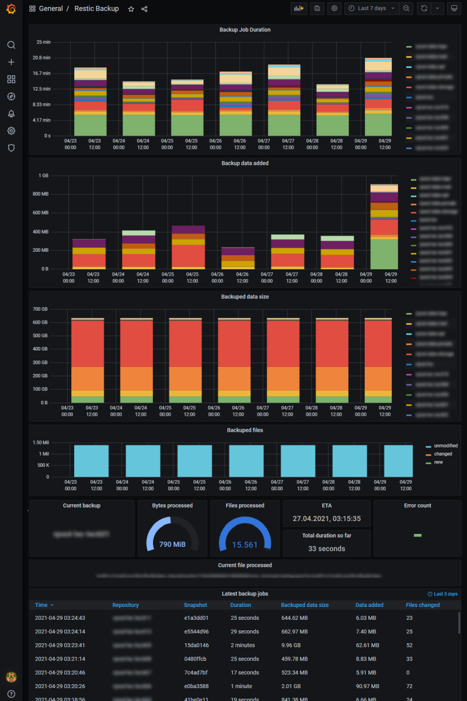

# restic2influx

Parse [Restic](https://restic.net/) status output and feed summary to influx db.

As a bonus, the program also shows the progress of the backup in the process list:
```
$ ( restic backup --json -r /path/to/backup /path/to/MyMusic | restic2influx -s MyMusic grafana http://influxsrv:8086 ) &

$ ps auwwf | grep restic
 18:06 0:01  |  restic backup --json -r /path/to/backup /path/to/MyMusic
 18:06 0:01  |  \_ restic2influx MyMusic [Done: 53.31% ETA: 04-09 18:07 Files: 8.452 MBytes: 149]
```

## Usage

```
$ restic backup --json <restic backup options> | restic2influx [-d] [-v] [-s] <restic repository> <influx db> [influx host]

-s, --status[=N] additionally send status information to influxdb every N seconds (default 30) during the backup job
-v, --verbose    print summary and other info to stdout
-d, --debug      output debug info, do not send data to influxdb
-u, --user       influxdb basic auth user
-p, --password   influxdb basic auth password

'influx host' defaults to http://localhost:8086 if omitted
```

Before using it, you need to install some non-core libraries, i.e. on Debian systems
simply execute: `apt-get install libjson-perl libinfluxdb-lineprotocol-perl libwww-perl libtext-unidecode-perl`.

## Grafana

With [Grafana](https://grafana.com/) one can realize beautiful diagrams of the
data, feel free to [download dashboard example](restic2influx-grafana.json)
and modify it according to your needs:



## Credits

- Forum user [griffon](https://forum.restic.net/u/griffon/) implemented a
[similar approach](https://forum.restic.net/t/restic-grafana-dashboard/1662/8) using `jq`.

- Similiar Grafana dashboards by [dmatt](https://grafana.com/grafana/dashboards/11064) and
[Alexander](https://grafana.com/grafana/dashboards/4198) using
[runrestic](https://pypi.org/project/runrestic/).

- [Autorestic](https://github.com/cupcakearmy/autorestic) might be helpful
  as well.

